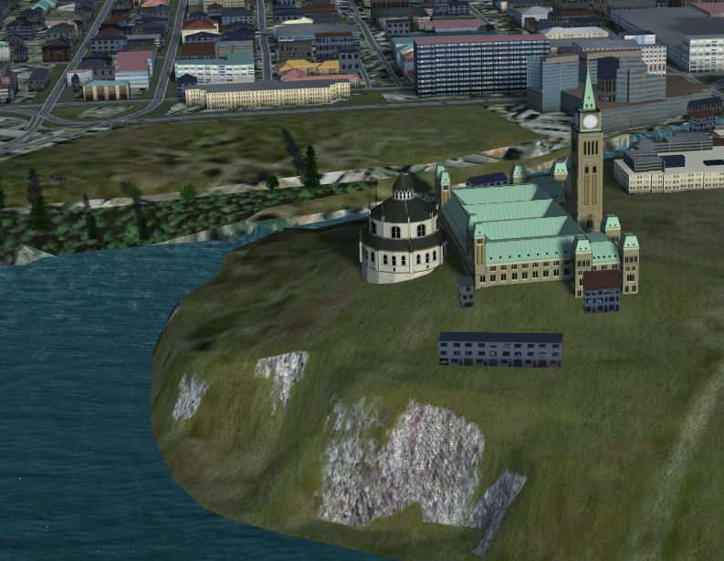

Blender model of the Canadian Parliament Buildings
==================================================

These are Public Domain, low-polygon models of the Canadian Parliament Buildings for flight simulation or other users where the buildings won't be viewed close up.

This model is intended initially for use in the open-source [FlightGear flight simulator](https://flightgear.org), but is free for anyone to use.

Closest airfield: [Rockcliffe](https://ourairports.com/airports/CYRO/) (CYRO).

## Models

- Centre Block
- Parliamentary Library

## Author

Started by David Megginson, 2024-10

## License

This model is in the Public Domain. See UNLICENSE.md for details.
